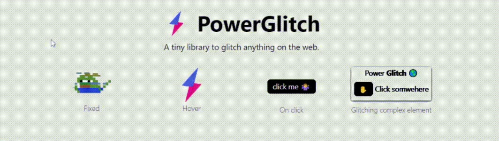

# Vue PowerGlitch



PowerGlitch is a standalone library with no external dependencies. It leverages CSS animations to create a glitch effect on images. No canvas or DOM manipulations are needed. It weights around 1.8kb minified and gzipped and 4kb minified.

This library is a wrapper around the [PowerGlitch](https://github.com/7PH/powerglitch) library to glitch any image in Vue applications.

## Getting started

1. Install `vue-powerglitch` using a package manager
    ```bash
    npm i --save vue-powerglitch
    # or
    yarn add vue-powerglitch
    ```

2. Import the component provided by the library
    ```js
    import { GlitchedImage } from 'vue-powerglitch'
    ```
    or using ES5 require
    ```javascript
    const GlitchedImage = require('vue-powerglitch').GlitchedImage
    ```

3. Add the component to your Vue app
    ```vue
    <GlitchedImage
        src="https://raw.githubusercontent.com/7PH/vue-powerglitch/master/assets/logo.png"
        :options="{
            //... (optional) customize the glitch effect here
        }"
    />
    ```

4. That's it, your image is glitched!
5. In `options`, you can give any value accepted by [the original PowerGlitch library](https://github.com/7PH/powerglitch). You can also check the [playground](https://7ph.github.io/powerglitch/#/playground) to find out the best glitch options for your image.

## Gotcha 

You have to set the width and height of the `GlitchedImage` component to the size of the image you want to glitch. Otherwise, the image might not be visible. 
